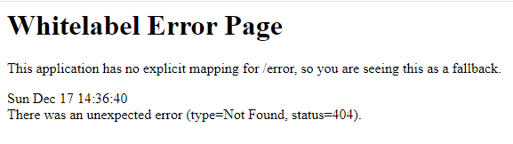

### Whitelabel Error Page

**Default Error Page** 

When a Spring Boot web application encounters an error like a 404 (Not Found) or 500 (Internal Server Error), and there is no custom error page configured, Spring Boot provides a default error page. This is known as the "whitelabel error page". 

**Property**

`server.error.whitelabel.enabled` 

This property is used to enable or disable the default whitelabel error page. By default, this property is set to true, which means the whitelabel error page is enabled.

If you set `server.error.whitelabel.enabled` to `false`, Spring Boot will not show the default error page. Instead, if there is no custom error page configured, the server will return a basic error response.

###Usage Scenarios###

**Development:** During development, having whitelabel error pages can be useful for quickly diagnosing issues without needing to set up custom error handling immediately.

**Production:** In a production environment, it's generally recommended to disable whitelabel error pages and provide custom error handling and pages. This is for both aesthetic reasons (to maintain consistent branding and user experience) and for security reasons (to avoid exposing too much information about the application structure or internal workings).