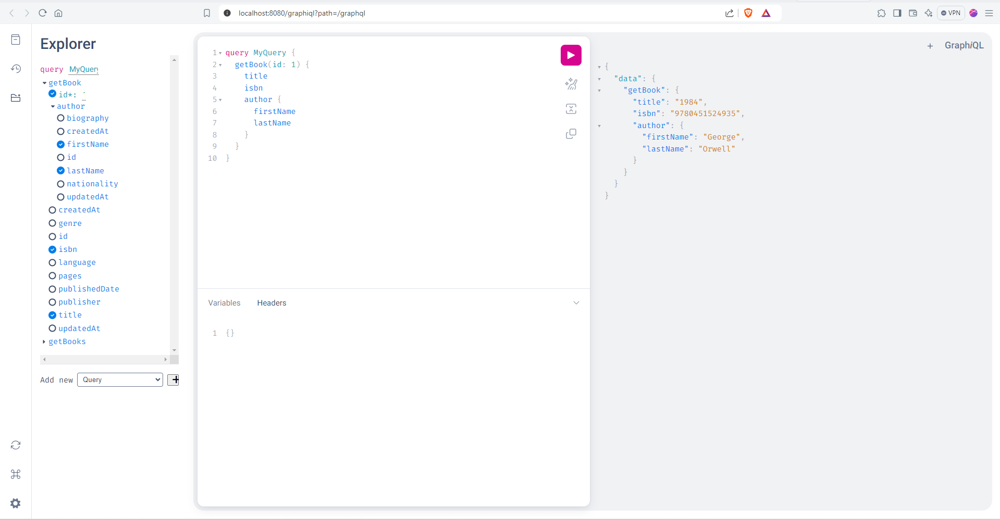

# springboot-graphql
Spring Boot GraphQL API

## Tech Stack

**Spring-boot**, **Java21**, **GraphQL**, **MySQL8**, **Spring Data JPA**, **flyway**, **maven**

## Queries

(1) Get Book By Id

(2) Get Book By Id

(3) Get Books

(4) Update Book

(5) Delete Book

