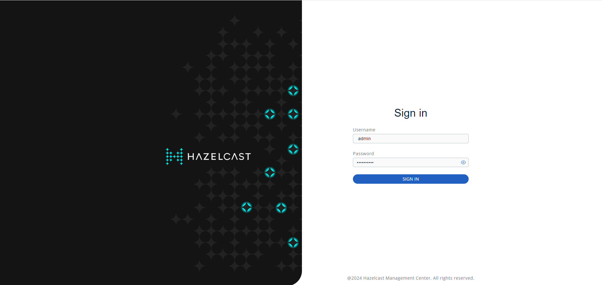
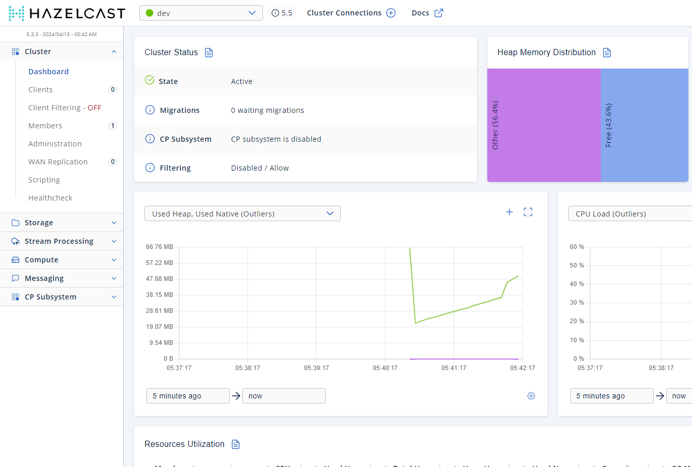
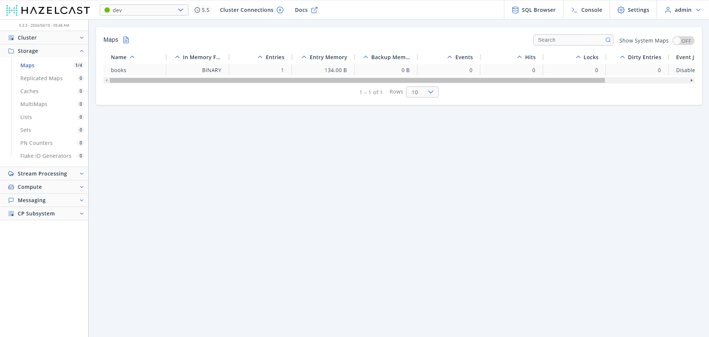
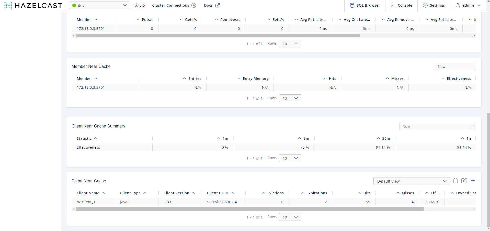

## Springboot-hazelcast
Spring Boot and Hazelcast (Distributed Cache)

### Cache topologies
- Embedded-cache
- Client-server
- near-cache

### client-server
Run the Hazelcast nodes and Hazelcast management center

`docker-compose -f docker-compose-hazelcast.yml up -d`

`docker-compose -f docker-compose-hazelcast.yml down`

	<h4>Hazelcast mgmt center login</h4>	
	

 

	<h4>Hazelcast mgmt center dev cluster</h4>	
	

	<h4>Cache Map created by client app in the Hazelcast node</h4>	
	

### near-cache
Run the Hazelcast nodes and Hazelcast management center

`docker-compose -f docker-compose-hazelcast.yml up -d`

	<h4>Hazelcast Near cache info</h4>	
	

 
