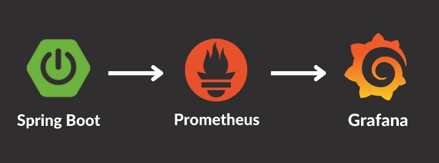
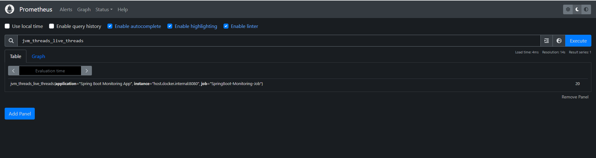
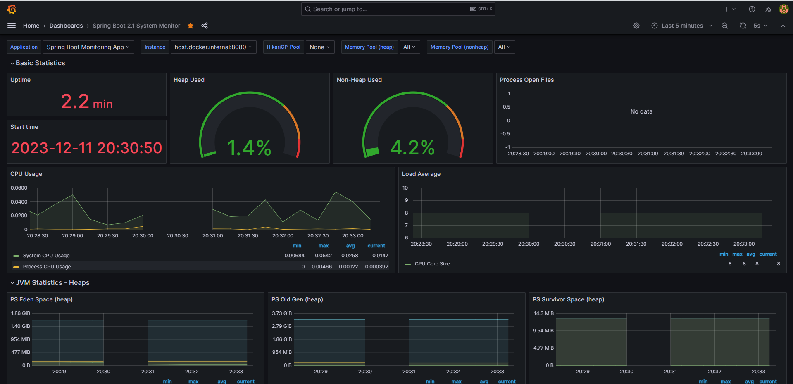

### Monitoring Spring Boot applications using Prometheus and Grafana

### Prometheus
Prometheus is a popular open-source monitoring and alerting system. It collects, stores, and analyzes metrics from various sources.

### Grafana
Grafana is an open-source tool for data visualization, monitoring, and troubleshooting. It creates dashboards to visualize metrics from sources like Prometheus, Elasticsearch, and CloudWatch.

### Actuator
`spring-boot-starter-actuator`

Actuator dependency for exposing information about the application’s health, metrics, configuration, and monitoring.
	
### Micrometer
`micrometer-registry-prometheus`

Micrometer dependency for exposing metrics in a format that Prometheus can scrape and store.

### Info
`prometheus.yml`

The scrape config instructs Prometheus to scrape the `http://localhost:8080/actuator/prometheus` endpoint on the host.docker.internal:8080 address every 5 seconds. The application label is used to identify the application in Prometheus.

`datasources.yml`

The data source instructs Grafana to connect with Prometheus using `http://prometheus:9090` and use it as the default data source.

Prometheus is accessible via `http://localhost:9090`

Grafana is accessible via `http://localhost:3000`

