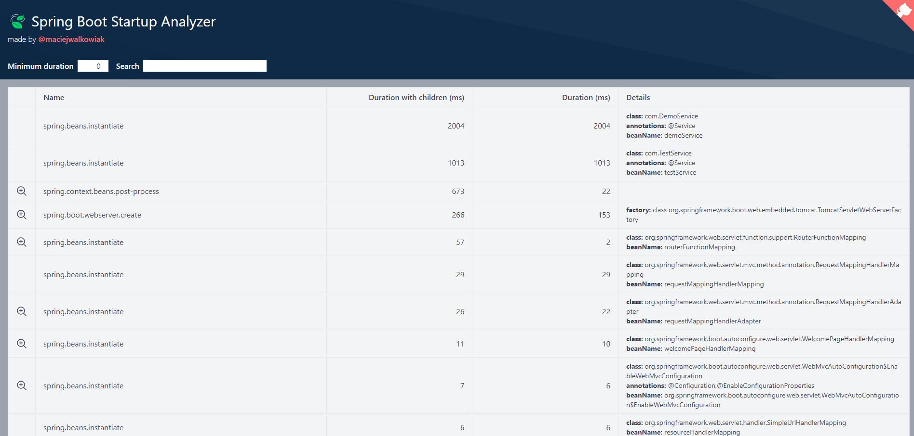

# springboot-startup-report
Spring Boot Startup Report library generates an interactive Spring Boot application startup report that lets you understand what contributes to the application startup time and perhaps helps to optimize it.

### Access the report at /startup-report

`http://localhost:8080/startup-report`

	<h4>Spring-boot-statup-report</h4>	
	

