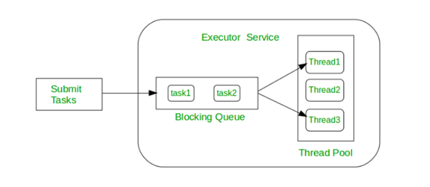

### TaskExecutor

The Task Executor in Spring Boot is an abstraction over Java's Executor Service. It's a part of the Spring framework that provides a way to execute tasks asynchronously, typically by managing a pool of threads.

### Why we should use it?  
Spring Boot’s task executor offers a higher level of abstraction with additional benefits like easier configuration, integration with Spring’s features, improved thread pool management, and better transactional and exception handling support.

